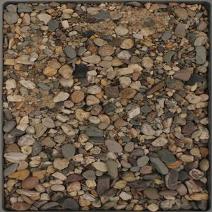
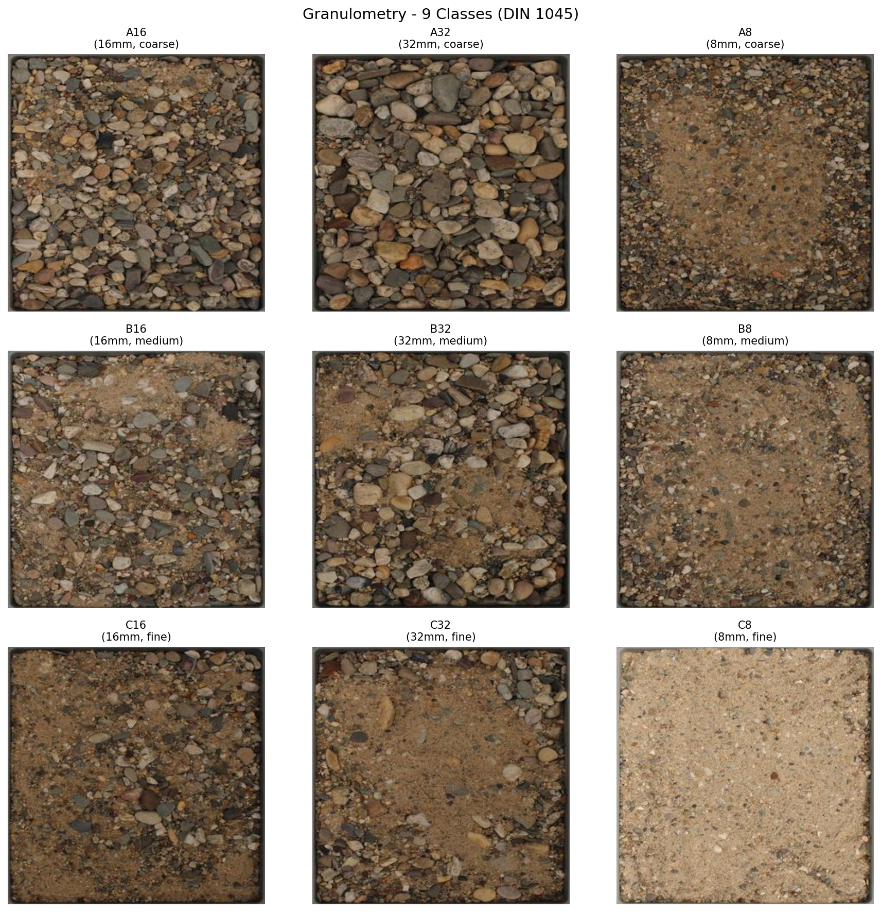
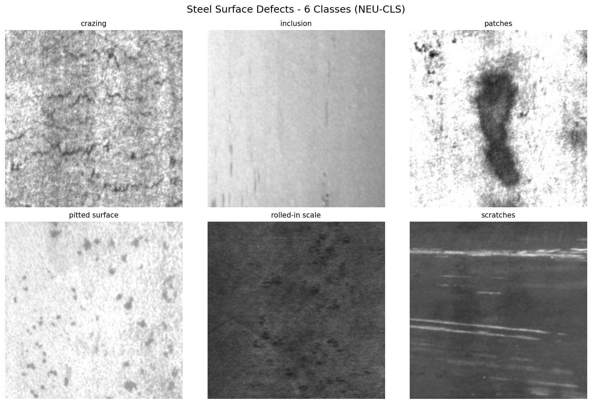
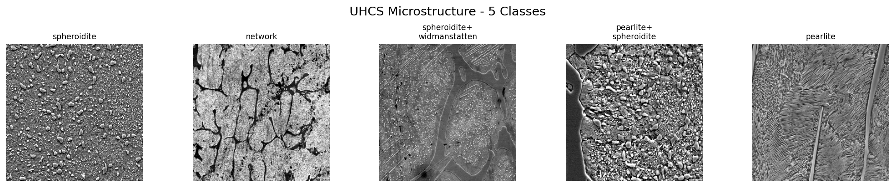
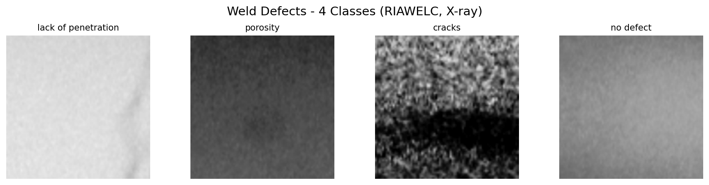

# Answer-Conditioned Chain-of-Thought Distillation for Few-Shot Industrial Vision with Small VLMs

---

## Abstract

Deploying AI-based visual inspection in manufacturing is challenging because production requirements change frequently, new defect types emerge, and large labeled datasets are rarely available on the factory floor. Traditional vision models require thousands of annotated images and lengthy retraining cycles, making them impractical when only a handful of expert-labeled samples exist. We propose answer-conditioned chain-of-thought (CoT) distillation as a method for rapidly adapting small vision-language models (VLMs) to new industrial tasks using minimal labeled data. A frontier VLM is given each training image along with its correct label and generates a justified visual explanation describing why the classification is correct. A 3B-parameter model is then fine-tuned on these reasoning-augmented examples via LoRA. By conditioning on correct answers, we guarantee accurate reasoning in all training data, which is critical because the frontier model's own classification accuracy ranges from 29.6% to 91.1% across our tasks. We validate the method on four industrial classification tasks spanning three image modalities (macro photography, optical microscopy, and X-ray radiography) using only 18 to 30 labeled images per task. Our method consistently outperforms direct fine-tuning by 0.9 to 8.3 percentage points across all four domains. On weld radiograph defect classification, the fine-tuned 3B model outperforms the frontier model by 10.8 percentage points using just 24 training images. On concrete aggregate grading, a task with 9 classes, the model achieves 79.6% accuracy from only 18 images where the base model scores 12.0% and the frontier model scores 29.6%. These results demonstrate that answer-conditioned CoT distillation enables practical industrial deployment of VLMs in data-scarce environments where collecting large datasets is infeasible due to cost, rarity of defects, or rapidly changing inspection criteria.

---

## 1. Introduction

Visual quality inspection is central to manufacturing. Every production line needs to identify defects, classify materials, or verify compliance with standards. In practice, these inspection requirements change often. A factory may switch products, encounter new defect types, or adopt updated grading standards. Each change demands a new or retrained vision model.

Traditional approaches rely on convolutional neural networks trained on thousands of labeled images [1]. Collecting this data is expensive. Expert annotators are scarce. Some defect types are rare by nature. In many real settings, a factory has fewer than 30 labeled examples of a new inspection task and needs a working classifier within days, not months.

Large vision-language models (VLMs) like GPT-4.1 offer a potential shortcut. These models can interpret images and follow natural language instructions without task-specific training. However, their accuracy on specialized industrial tasks is often poor. On concrete aggregate grading, a 9-class problem defined by DIN 1045 [2], GPT-4.1 achieves only 29.6% accuracy in a few-shot setting. On steel surface defect classification, it reaches 91.1% but requires curated reference images. Performance varies widely across domains, and these models cannot be deployed on-premises due to cost, latency, and data privacy constraints.

Small VLMs in the 1-7B parameter range [3] are attractive for deployment. They fit on edge hardware, run without cloud connectivity, and can be fine-tuned with parameter-efficient methods like LoRA [4]. The problem is that standard fine-tuning on 18-30 images teaches the model to map specific images to labels but does not transfer domain knowledge. The model memorizes rather than learns.

Chain-of-thought (CoT) prompting [5] has shown that including reasoning steps improves model performance on complex tasks. CoT distillation [6] extends this idea by training smaller models on reasoning-augmented data generated by larger models. However, existing CoT distillation work focuses on text-only language models. The SEAL framework [7] demonstrated that models can improve through self-generated training data with answer-conditioned edits, but again only for text tasks.

We propose answer-conditioned CoT distillation for VLMs. The method works as follows: a frontier VLM receives each training image along with its correct label and generates a visual explanation describing why that label is correct, using domain-specific terminology and contrastive reasoning. A small VLM is then fine-tuned on these reasoning-augmented training pairs via LoRA. The frontier model is not classifying. It already knows the answer. It is explaining what visual features justify that answer and why similar classes do not apply.

This design choice is critical. The frontier model's own classification accuracy ranges from 29.6% to 91.1% across our four tasks. If we asked it to classify and explain (the standard CoT distillation approach), 9% to 70% of the training data would contain incorrect reasoning. By conditioning on the correct answer, we guarantee that every training example contains accurate, grounded visual reasoning.

We validate this method on four industrial classification tasks:

- Concrete aggregate grading (9 classes, macro photography) [8]
- Steel surface defect detection (6 classes, grayscale surface images) [9]
- Steel microstructure classification (5 classes, optical/SEM microscopy) [10]
- Weld defect identification (4 classes, X-ray radiography) [11]

Using only 18 to 30 labeled images per task, our method consistently outperforms direct fine-tuning across all four domains. The complete training pipeline (CoT generation + LoRA fine-tuning) completes in under 2 hours per task on a single NVIDIA L4 24GB GPU, and under 4 hours even on older multi-GPU configurations (2x V100 16GB), making same-day adaptation feasible on any sufficiently powerful hardware. On weld radiography, the fine-tuned 3B model outperforms GPT-4.1 few-shot by 10.8 percentage points. On concrete grading, it achieves 79.6% where the base model scores 12.0% and the frontier model scores 29.6%.

Our contributions are:

1. We introduce answer-conditioned CoT distillation for VLMs, where a frontier model generates justified reasoning given the correct answer, and a small model is fine-tuned on these reasoning-augmented examples.
2. We validate the method across four industrial domains spanning three image modalities, showing consistent improvement over direct fine-tuning (+0.9 to +8.3 percentage points).
3. We demonstrate that a 3B-parameter model fine-tuned on 24 images can outperform a frontier model on weld defect classification.
4. We show that this approach addresses a real manufacturing need: rapid adaptation to new inspection tasks when only minimal labeled data is available, with end-to-end training completing in under 2 hours on a single GPU.

---

## 2. Related Work

We situate our work at the intersection of four research areas: chain-of-thought distillation, knowledge distillation for VLMs, few-shot industrial vision, and self-adapting language models.

### 2.1 Chain-of-Thought Distillation

Chain-of-thought (CoT) prompting [5] showed that including intermediate reasoning steps improves performance on complex tasks. Hsieh et al. [6] extended this idea to knowledge distillation, demonstrating that training small language models on reasoning-augmented outputs from larger models outperforms both standard fine-tuning and the teacher model itself, while requiring less data. Their work, "Distilling Step-by-Step," is the closest precursor to our approach. However, it operates entirely in the text domain. We extend this principle to vision-language models, where the teacher generates image-grounded visual reasoning rather than text-only rationales.

More recent work on CoT distillation for smaller models [12] addresses memorization risks in text-only settings. Our approach avoids this issue through answer-conditioning: by providing the correct label to the teacher, we guarantee that the generated reasoning is both correct and grounded in the specific visual content of each image.

### 2.2 Knowledge Distillation for Vision-Language Models

Several recent papers address distillation in the VLM setting. VLsI [13] distills internal representations from large VLMs to smaller ones using natural language verbalizers at each layer. This differs from our approach, which distills output-level reasoning rather than intermediate activations. Knowledge distillation from VLMs for long-tail recognition [14] uses logit-based distillation to transfer knowledge about rare classes. Our method uses text-based reasoning transfer, which is more interpretable and does not require access to teacher model logits. Online In-Context Distillation [15] maintains the teacher at inference time for collaborative prediction. We bake the teacher's knowledge into the student's weights, eliminating inference-time dependency on the frontier model.

None of these methods use answer-conditioned reasoning generation as the distillation mechanism.

### 2.3 SEAL and Self-Adapting Models

The SEAL framework [7] introduced self-adapting language models that generate their own fine-tuning data through "self-edits" and update their weights via LoRA [4]. Zhang [16] reproduced SEAL and found that using an external editor (a separate, stronger model) matches or exceeds the performance of self-editing. This finding directly supports our use of GPT-4.1 as an external editor for generating training data.

Our adaptation of SEAL to the VLM setting differs in two ways. First, we condition on the correct answer rather than asking the model to solve and explain. This is necessary because the frontier model's own accuracy varies from 29.6% to 91.1% across our tasks. Letting it classify freely would produce incorrect reasoning in a significant fraction of training data. Second, our teacher generates image-grounded descriptions that reference specific visual features, not generic text knowledge.

### 2.4 Industrial Vision with VLMs and Foundation Models

Adapting vision foundation models for industrial settings [17] typically requires large datasets and self-supervised pretraining on domain-specific images. CLIP-based approaches for few-shot manufacturing quality control [18] demonstrate the value of contrastive vision-language models in industrial settings but require 50-100 examples and do not generate explicit reasoning. More recent work on VLMs for anomaly classification [19] shows strong zero-shot performance but does not fine-tune the model or incorporate domain expertise through distillation.

Our approach fills a gap in this literature: we show that a 3B-parameter generative VLM, fine-tuned on fewer than 30 images with answer-conditioned CoT distillation, can match or exceed frontier models on specialized industrial tasks. No prior work applies CoT distillation to industrial vision classification across multiple domains.

### 2.5 Concrete Aggregate Classification

The granulometry dataset used in this work was introduced by Coenen et al. [8], who applied CNN-based regression to predict continuous grading curves from aggregate images. Their approach used a full training dataset and predicted continuous distributions. We address a different formulation: discrete 9-class classification using only 18 labeled images from the same dataset. To our knowledge, this is the first application of VLMs and CoT distillation to concrete aggregate grading.

---

## 3. Method

Our method adapts a small VLM to a new industrial classification task using two inputs: a small set of labeled images (18-30) and access to a frontier VLM API. The process has three stages: (1) prompt design, (2) answer-conditioned CoT generation, and (3) LoRA fine-tuning with reasoning-augmented data.

### 3.1 Problem Formulation

Given a set of $N$ labeled training images $\{(x_i, y_i)\}_{i=1}^{N}$ where $x_i$ is an image and $y_i$ is its class label, we want to fine-tune a small VLM $M_s$ so that it accurately classifies unseen images from the same domain. The challenge is that $N$ is small (18-30), which makes standard fine-tuning prone to memorization rather than learning generalizable features.

We address this by using a frontier VLM $M_f$ (GPT-4.1) to generate rich visual reasoning for each training image. The frontier model does not classify the image. Instead, it receives the correct answer and explains why that answer is correct based on what it sees. This produces training data that teaches the small model how to reason about visual features, not just memorize image-label mappings. This approach is inspired by CoT distillation [6] and the SEAL framework [7], but differs in two key ways: we condition on the correct answer (unlike standard CoT distillation where the teacher must solve the task), and we operate in the vision-language domain (unlike SEAL which addresses text-only LLMs).

### 3.2 Prompt Design

Each task uses a single classification prompt that serves as both the training prompt and the evaluation prompt. This prompt contains:

1. Image context (modality, resolution, magnification where relevant)
2. All class definitions with detailed visual descriptions
3. Contrastive features distinguishing similar classes
4. Output format instruction (JSON)

The same prompt is used for both approaches (Direct and CoT-augmented) and for evaluation. This consistency is critical. In early experiments, using weaker class definitions during training degraded accuracy by over 18 percentage points, even with the same training images.

**Example prompt (concrete aggregate grading):**

```
Classify this concrete aggregate photograph.
Ground sampling distance (GSD) = 2.1 px/mm.
At this GSD: 8mm stone ≈ 17px, 16mm ≈ 34px, 32mm ≈ 68px.

Classification axes:
1. MAX PARTICLE SIZE: estimate the largest stone's width in pixels, divide
   by GSD, round to 8, 16, or 32 mm.
2. GRADING (DIN 1045 standard — describes size DISTRIBUTION, not absolute
   size):
   - COARSE (A): particles concentrated near max size. Gaps between stones
     are EMPTY. Uniform, single-layer texture.
   - MEDIUM (B): balanced mix. Gaps PARTIALLY filled by smaller particles.
   - FINE (C): wide size range. Gaps COMPLETELY filled with small particles.
     Dense, packed texture.

Respond with JSON: {"max_particle_size_mm": <8, 16, or 32>,
                    "grading": "<coarse, medium, or fine>"}
```

### 3.3 Answer-Conditioned CoT Generation

For each training image $(x_i, y_i)$, we generate justified visual descriptions from the frontier model. The key design choices are:

**Answer-conditioning.** The frontier model receives the correct label $y_i$ along with the image $x_i$. It does not classify. It explains why $y_i$ is correct based on what it observes. This guarantees 100% correct reasoning in all training data.

Without answer-conditioning, the frontier model would need to classify correctly to produce useful reasoning. Since its accuracy ranges from 29.6% to 91.1% across our tasks, a significant fraction of unconditioned reasoning would be wrong.

**Contrastive reasoning.** The generation prompt instructs the frontier model to explain not only why the image matches the given class, but also why it does not match the most similar alternative class. This teaches decision boundaries between confusable categories.

**Multiple descriptions per image.** We generate 3 descriptions per image at temperature 0.7, providing diversity in reasoning style while maintaining correctness. Combined with 1 direct JSON-only example, this yields 4 training pairs per image.

**Prompt stripping for CoT examples.** For the CoT training pairs, the "Respond with JSON" instruction is removed from the user prompt. This way, the model learns two response modes: when asked for JSON, output JSON directly. When asked without the JSON constraint, output reasoning followed by JSON.

[FIGURE 1: Pipeline illustration showing a concrete aggregate training image alongside the two training approaches.]



*Figure 1: A concrete aggregate photograph (class A16: 16mm max particle size, coarse grading). Below, we show the two training pair formats constructed from this single image.*

**Example: Direct LoRA training pair**

- User: [aggregate image] + [full classification prompt above]
- Assistant: `{"max_particle_size_mm": 16, "grading": "coarse"}`

**Example: Augmented LoRA training pair (same image)**

- User: [aggregate image] + [classification prompt WITHOUT last 2 lines]
- Assistant:

```
The largest stones in this image appear to be around 16 mm, fitting the
max_particle_size_mm: 16 classification. The gaps between the largest stones
are mostly empty, with very few smaller particles filling the spaces, which
is characteristic of a coarse grading. The overall texture looks uniform and
not densely packed with mixed sizes, supporting the classification of coarse
aggregate according to DIN 1045.
{"max_particle_size_mm": 16, "grading": "coarse"}
```

The Direct pair teaches "this image = this label." The augmented CoT pair teaches "stones around 16mm with empty gaps between them = coarse grading, because DIN 1045 defines coarse as uniform particles with unfilled gaps." This reasoning transfers to unseen images where distinguishing coarse from medium grading requires understanding gap patterns.

From this single image, 3 different CoT descriptions are generated (temperature 0.7), each phrasing the reasoning slightly differently. Combined with 1 direct pair, this yields 4 training examples from 1 labeled image.

### 3.4 Training Data Construction

For each task, we construct two training datasets from the same $N$ labeled images:

**Approach A (Direct LoRA):** Each image gets 1 training pair:
- User: [image] + [full classification prompt including JSON instruction]
- Assistant: [correct JSON label]

This produces $N$ training examples.

**Approach B (Augmented LoRA with answer-conditioned CoT):** Each image gets 4 training pairs:
- 3 CoT pairs, each consisting of:
  - User: [image] + [classification prompt WITHOUT the JSON output instruction]
  - Assistant: [GPT-4.1 generated description] + [correct JSON label appended by code]
- 1 direct pair (same as Approach A)

This produces $4N$ training examples from the same $N$ images. The 3 CoT descriptions are generated at temperature 0.7 to provide variation in reasoning style while the answer remains correct. The JSON is never generated by the frontier model. It is appended programmatically to guarantee format consistency.

### 3.5 LoRA Fine-Tuning

Both approaches use identical LoRA [4] hyperparameters applied to the Qwen2.5-VL-3B-Instruct model [3]:

| Parameter | Value |
|-----------|-------|
| Base model | Qwen2.5-VL-3B-Instruct [3] (BF16) |
| LoRA rank $r$ | 16 |
| LoRA $\alpha$ | 32 |
| LoRA dropout | 0.05 |
| Target modules | q, k, v, o, gate, up, down projections |
| Learning rate | $2 \times 10^{-5}$ |
| Epochs | 40 |
| Effective batch size | 4 (gradient accumulation) |
| Scheduler | Cosine with 10% warmup |
| Gradient clipping | 1.0 |

*Table 2: LoRA fine-tuning hyperparameters (identical for both approaches).*

During training, only the assistant response tokens contribute to the loss. All user-prompt and image tokens are masked with label value $-100$.

At evaluation, both models receive the full classification prompt (with JSON instruction) and generate a response with temperature 0.1. The JSON is parsed from the output, extracting it from within any surrounding description text if present.

### 3.6 Why Answer-Conditioned CoT Distillation Helps

The augmented approach outperforms Direct LoRA for two reasons:

**Data augmentation through reasoning diversity.** With only 18-30 training images, memorization is a real risk. The 3 different descriptions per image (generated at temperature 0.7) provide variation in how visual features are described, reducing overfitting to specific image patterns. This is consistent with findings from Hsieh et al. [6], who showed that rationale-augmented training data helps small models generalize better than direct fine-tuning alone.

**Contrastive decision boundary learning.** The generated descriptions explicitly state why an image is not a similar class. With Direct LoRA, the model only learns "this image = this label." With the augmented approach, it learns "circular dark spots = porosity, NOT cracks (which would be jagged lines)." This transfers more effectively to unseen images where the distinction between similar classes matters.


---

## 4. Experimental Setup

### 4.1 Datasets

We evaluate our method on four industrial classification tasks spanning three image modalities. Each task represents a real-world inspection scenario where labeled data is scarce and domain expertise is required.



*Figure 2: Concrete aggregate samples showing 9 classes (3 sizes x 3 gradings, DIN 1045).*



*Figure 3: Steel surface defect samples showing 6 defect classes (NEU-CLS dataset).*



*Figure 4: UHCS microstructure samples showing 5 microconstituent classes.*



*Figure 5: Weld radiograph samples showing 4 defect classes (RIAWELC dataset).*

**Concrete Aggregate Grading (Granulometry).** This dataset [8] contains macro photographs of concrete aggregate samples classified along two axes: maximum particle size (8, 16, or 32mm) and grading according to DIN 1045 [2] (coarse, medium, or fine). The combination yields 9 classes. Images are 2200x3000 pixels, resized to 800px maximum dimension during processing. We use 18 training images (2 per class) and 108 test images. The ground sampling distance (GSD) is computed dynamically based on the resize factor and used in the classification prompt.

**Steel Surface Defect Detection.** The NEU-CLS dataset [9] contains 200x200 pixel grayscale photographs of hot-rolled steel strip surfaces with 6 defect classes: crazing, inclusion, patches, pitted surface, rolled-in scale, and scratches. We use 30 training images (5 per class) and 360 test images from the validation split.

**Steel Microstructure Classification (UHCS).** The NIST Ultra-High Carbon Steel dataset [10] contains optical/SEM micrographs at varying magnifications showing microstructural features of UHCS after heat treatment. We classify 5 microconstituent classes: spheroidite, network, spheroidite+widmanstatten, pearlite+spheroidite, and pearlite. Images are 645x481 pixels. We use 30 training images (6 per class) and 120 test images. Magnification metadata is included in the classification prompt where available.

**Weld Defect Classification.** The RIAWELC dataset [11] contains 227x227 pixel grayscale radiographic (X-ray) images of weld joints with 4 classes: lack of penetration, porosity, cracks, and no defect. We use 24 training images (6 per class) and 240 test images (60 per class, randomly sampled from a larger test set).

| Dataset | Modality | Classes | Train Images | Test Images | Image Size |
|---------|----------|---------|-------------|-------------|------------|
| Granulometry [8] | Macro photo | 9 | 18 | 108 | 2200x3000 |
| NEU-CLS [9] | Surface (grayscale) | 6 | 30 | 360 | 200x200 |
| UHCS [10] | Microscopy (RGB) | 5 | 30 | 120 | 645x481 |
| RIAWELC [11] | X-ray (grayscale) | 4 | 24 | 240 | 227x227 |

*Table 1: Dataset summary across four industrial classification tasks.*

### 4.2 Baselines

For each task, we compare against four baselines:

**Base model zero-shot (Base ZS).** Qwen2.5-VL-3B-Instruct [3] evaluated with the classification prompt and the test image only, without any fine-tuning or reference examples. Zero-shot means the model receives no example images of any class prior to classification.

**Frontier model few-shot (GPT-4.1 FS).** GPT-4.1 evaluated with the classification prompt plus a grid of reference images (one representative image per class) provided alongside the test image. Few-shot means the model sees labeled reference examples at inference time. These reference images are drawn from the training split and are similar to the dataset sample images shown in Figures 2-5. The trained models (Direct and CoT-augmented) do not receive reference images at inference time. Their domain knowledge is learned during fine-tuning rather than provided at evaluation.

**Direct LoRA.** The small model fine-tuned on $N$ image-JSON pairs (Approach A from Section 3.4). This isolates the contribution of CoT distillation by providing a baseline with the same images, same model, and same hyperparameters but without reasoning augmentation. At evaluation, only the test image and classification prompt are provided.

**Answer-conditioned CoT LoRA.** The small model fine-tuned on $4N$ reasoning-augmented pairs (Approach B from Section 3.4). This is our proposed method. At evaluation, only the test image and classification prompt are provided (same as Direct LoRA).

### 4.3 Training Configuration

All training uses the configuration described in Table 2 of Section 3.5. Training images are selected randomly (seed 42) from the training split. The same seed ensures both Direct and augmented approaches train on the same images. The GPT-4.1 API generates CoT descriptions with temperature 0.7 and maximum 512 tokens.

All models reported in this paper were trained on 2x NVIDIA V100 16GB GPUs (Azure ML), with the model split across GPUs using `max_memory={0: '6GiB', 1: '15GiB'}`. As an additional comparison, we measured training times on a single NVIDIA L4 24GB GPU (GCP Vertex AI) using `device_map='auto'`. The L4 configuration was faster due to avoiding inter-GPU communication overhead from model sharding, demonstrating that the method is efficient on a range of GPU hardware.

| Task | Approach | Examples | Epochs | Time (2x V100 16GB) | Time (1x L4 24GB) |
|------|----------|----------|--------|----------------------|--------------------|
| Granulometry | Direct | 18 | 40 | ~24 min | 19 min |
| Granulometry | CoT-augmented | 72 | 40 | ~101 min | 77 min |
| Steel Surface | Direct | 30 | 40 | 40 min | 20 min |
| Steel Surface | CoT-augmented | 120 | 40 | 170 min | 85 min |
| UHCS | Direct | 30 | 40 | 58 min | 27 min |
| UHCS | CoT-augmented | 120 | 40 | 240 min | 111 min |
| Weld Defects | Direct | 24 | 40 | 30 min | 15 min |
| Weld Defects | CoT-augmented | 96 | 40 | 125 min | 62 min |

*Table 3: Training time per task and approach. All runs use 40 epochs with gradient accumulation of 4. The complete CoT-augmented pipeline completes in under 2 hours per task on a single L4 GPU, and under 4 hours on the 2x V100 configuration.*

### 4.4 Evaluation Protocol

Evaluation uses the held-out test split, which is never seen during training or CoT generation. Each test image is processed with the full classification prompt (including the JSON output instruction) at temperature 0.1 with `max_new_tokens=256`. The JSON is parsed from the model output. If the model produces a description followed by JSON (which happens with the augmented model), the JSON is extracted from within the text.

For granulometry, we report accuracy on both axes separately (size, grading) and their combination (both correct). For the other three tasks, we report overall classification accuracy. All metrics are computed on 100% of the test set.


---

## 5. Results

### 5.1 Cross-Task Comparison

Table 4 presents the main results across all four tasks. Our answer-conditioned CoT distillation (Augmented) outperforms Direct LoRA on every task, with improvements ranging from 0.9 to 8.3 percentage points. On three of four tasks, the fine-tuned 3B model also outperforms the frontier model (GPT-4.1) in its few-shot setting.

| Task | Classes | Train Imgs | Base ZS | GPT-4.1 FS | Direct LoRA | CoT-Augmented |
|------|---------|-----------|---------|------------|-------------|---------------|
| Granulometry | 9 | 18 | 12.0% | 29.6% | 71.3% | **79.6%** |
| Steel Surface | 6 | 30 | 21.7% | 91.1% | 63.1% | **66.7%** |
| UHCS Microstructure | 5 | 30 | 60.8% | 71.7% | 65.8% | **66.7%** |
| Weld Defects | 4 | 24 | 30.8% | 65.0% | 73.3% | **75.8%** |

*Table 4: Main results across four industrial classification tasks. Granulometry reports "both correct" (size AND grading). Other tasks report overall accuracy. Bold indicates best result per row. The CoT-augmented approach wins on all four tasks.*

Three observations stand out:

1. **CoT distillation consistently helps.** The augmented approach beats Direct LoRA on every task, ranging from +0.9pp (UHCS) to +8.3pp (granulometry). The largest gains appear where the task has more classes and more fine-grained visual distinctions.

2. **Small models beat the frontier model.** On weld defects, our 3B model outperforms GPT-4.1 few-shot by 10.8 percentage points (75.8% vs 65.0%). On granulometry, the gap is even larger: 79.6% vs 29.6% (50pp). This occurs despite the frontier model being the teacher that generated the training data.

3. **The improvement over base is large.** Across tasks, the CoT-augmented model improves over the base model by 5.9pp (UHCS) to 67.6pp (granulometry). On three of four tasks (excluding UHCS, where the base model's 60.8% is inflated by majority class bias), the method achieves 2.5x to 6.6x the base model's accuracy.

### 5.2 Granulometry Results (Detailed)

Granulometry is a 9-class problem with two classification axes. Table 5 breaks down accuracy per axis.

| Method | Size Accuracy | Grading Accuracy | Both Correct |
|--------|--------------|------------------|--------------|
| Base ZS | 36.1% | 34.3% | 12.0% |
| GPT-4.1 FS | 62.0% | 59.3% | 29.6% |
| Direct LoRA | 89.8% | 78.7% | 71.3% |
| CoT-Augmented | **91.7%** | **86.1%** | **79.6%** |

*Table 5: Granulometry results broken down by classification axis. The CoT-augmented approach shows the largest improvement on grading (+7.4pp over Direct), which is the harder axis requiring understanding of size distribution patterns.*

The grading axis benefits most from CoT distillation (+7.4pp vs +1.9pp for size). This is expected: grading requires understanding whether gaps between stones are empty (coarse), partially filled (medium), or completely filled (fine). The CoT descriptions explicitly teach these gap-pattern distinctions, which is harder to learn from JSON-only supervision.

Per-class accuracy for the augmented model shows that coarse (A) and fine (C) gradings at larger particle sizes are easiest, while C32 (fine grading, 32mm) is hardest at 42%. This class requires detecting that gaps are filled despite large dominant particles, a subtle visual distinction.

### 5.3 Weld Defect Results

The weld defect task produces the strongest headline result: the 3B model beats GPT-4.1 few-shot by 10.8 percentage points. Per-class accuracy reveals the structure:

| Class | N (test) | Direct LoRA | CoT-Augmented |
|-------|----------|-------------|---------------|
| no_defect | 60 | 87% | **98%** |
| porosity | 60 | 83% | **83%** |
| lack_of_penetration | 60 | 65% | **72%** |
| cracks | 60 | **58%** | 50% |

*Table 6: Per-class accuracy on weld defects. Bold indicates best per row. Cracks are the hardest class for all methods. Even 50% accuracy (CoT-augmented) represents a major improvement from 0% (all baselines at zero-shot).*

Cracks remain the hardest class. All baseline models score 0% on cracks in zero-shot mode. With just 6 training images of cracks, the augmented model reaches 50%. The frontier model reaches only 30% even with few-shot examples. This suggests the fine-tuned small model learns crack-specific features more effectively than the frontier model's in-context learning.

Note: On this task, Direct LoRA slightly outperforms CoT-augmented on the cracks class (58% vs 50%), while CoT-augmented is better overall. This per-class variation suggests that the two approaches learn different decision boundaries.

### 5.4 Steel Surface Results

Steel surface defects present the most challenging scenario for our method. GPT-4.1 few-shot achieves 91.1% on this task, well above our fine-tuned model's 66.7%. The gap exists because GPT-4.1's few-shot setting includes reference images for each class, providing the model with direct visual comparisons that are highly effective for these 200x200 grayscale images.

Per-class results reveal the bottleneck:

| Class | N (test) | Direct LoRA | CoT-Augmented |
|-------|----------|-------------|---------------|
| pitted_surface | 60 | 83% | **85%** |
| scratches | 60 | 63% | **85%** |
| crazing | 60 | **83%** | 68% |
| patches | 60 | 52% | **75%** |
| rolled-in_scale | 60 | **58%** | 55% |
| inclusion | 60 | **38%** | 32% |

*Table 7: Per-class accuracy on steel surface defects. Bold indicates best per row. The augmented approach gains on patches and scratches but loses on crazing. Inclusion is hardest for both methods.*

Inclusion is consistently the hardest class, scoring only 32% (augmented) and 38% (direct). Inclusions appear as dark elongated streaks that are visually similar to scratches in grayscale images. The augmented approach shows a notable improvement on scratches (63% to 85%) and patches (52% to 75%), demonstrating that contrastive reasoning helps where visual features are more distinct. However, it slightly regresses on crazing (83% to 68%), suggesting that the CoT descriptions for crazing may introduce some confusion. Overall, the augmented approach still outperforms Direct LoRA (66.7% vs 63.1%).

### 5.5 UHCS Microstructure Results

UHCS shows the smallest improvement from CoT distillation (+0.9pp). The base model already achieves 60.8% zero-shot (inflated by spheroidite majority class bias), and GPT-4.1 few-shot reaches 71.7%. Our CoT-augmented model achieves 66.7%, approaching but not exceeding the frontier model.

| Class | N (test) | Direct LoRA | CoT-Augmented |
|-------|----------|-------------|---------------|
| spheroidite | 74 | **74%** | 72% |
| network | 20 | 75% | **80%** |
| spheroidite+widmanstatten | 15 | 13% | **27%** |
| pearlite+spheroidite | 5 | **100%** | 80% |
| pearlite | 3 | 67% | **100%** |

*Table 8: Per-class accuracy on UHCS microstructure. Bold indicates best per row. The compound class spheroidite+widmanstatten improves from 13% to 27% with CoT augmentation, though it remains the hardest class.*

The challenge here is compound classes. "Spheroidite+widmanstatten" requires detecting two co-existing features (dots AND needles) in the same image. With only 6 training images for this class, both approaches struggle. The augmented method doubles the accuracy on this class (13% to 27%), showing that contrastive descriptions help the model learn compound visual patterns. The small test set sizes for pearlite (3) and pearlite+spheroidite (5) make per-class comparisons on those classes unreliable.


---

## 6. Discussion

### 6.1 When Does CoT Distillation Help Most?

The improvement from answer-conditioned CoT distillation varies across tasks: +8.3pp on granulometry, +3.6pp on steel, +2.5pp on weld defects, and +0.9pp on UHCS. This variation correlates with task structure.

The largest gain (granulometry) occurs on a task with many classes (9) and fine-grained visual distinctions. Grading requires understanding spatial relationships between particles (whether gaps are empty, partially filled, or completely filled). This kind of relational reasoning transfers well through natural language descriptions. Direct JSON training cannot teach these relationships explicitly.

The smallest gain (UHCS) occurs on a task dominated by a majority class (spheroidite: 62% of test set) and compound classes that require detecting multiple co-existing features. When the test set is imbalanced and the hard classes have very few test samples, the method's advantage on minority classes is diluted in the overall accuracy.

### 6.2 Why Answer-Conditioning Is Necessary

Answer-conditioning is not optional. The frontier model's own classification accuracy ranges from 29.6% (granulometry) to 91.1% (steel surface, with few-shot references). If we used standard CoT distillation (let the teacher classify and explain), between 9% and 70% of the training reasoning would be wrong. Training on incorrect reasoning would teach wrong decision boundaries.

By providing the correct answer, we decouple the teacher's classification ability from its description ability. GPT-4.1 can describe visual features competently even on tasks where it classifies poorly. This decoupling is what allows the student to outperform the teacher: the student inherits correct reasoning patterns without inheriting the teacher's classification errors.

### 6.3 The Steel Surface Gap

On steel surface defects, GPT-4.1 few-shot (91.1%) significantly outperforms our CoT-augmented model (66.7%). This is the only task where the frontier model maintains a large advantage. The likely reason is that GPT-4.1's few-shot setting provides reference images for each class, enabling direct visual comparison. For 200x200 grayscale images where defect classes differ primarily in texture patterns, this visual reference is highly effective.

Our method does not provide reference images at inference time. The model must rely on learned internal representations. With only 5 training images per class (30 total), there may be insufficient coverage of the visual variation within each class. This suggests that the method's effectiveness depends partly on the ratio of training examples to intra-class visual diversity.

### 6.4 Limitations

**Single base model.** All experiments use Qwen2.5-VL-3B [3]. We do not evaluate whether the method generalizes to other VLM architectures or model sizes. A larger model (7B or above) might benefit less from CoT augmentation if it already has sufficient capacity for direct learning.

**Single seed per task.** Due to compute constraints, each configuration was trained with a single random seed (42). We cannot report confidence intervals or statistical significance. The +0.9pp improvement on UHCS, in particular, may not be reliable without multiple runs.

**No ablation on augmentation ratio.** We use 3 CoT descriptions per image in all experiments. The optimal number may vary by task. More descriptions could help on harder tasks, or could introduce diminishing returns on easier ones.

**Fixed training epochs.** All models train for 40 epochs regardless of dataset size. This means the direct models (18-30 examples) see each image ~40 times, while the augmented models (72-120 examples) see each image ~10 times (across its 4 variants). Optimizing epochs per approach could improve both baselines.

---

## 7. Conclusion

We introduced answer-conditioned chain-of-thought distillation for rapidly adapting small vision-language models to industrial inspection tasks. The method uses a frontier VLM to generate justified visual reasoning for each training image, conditioned on the correct label, then fine-tunes a 3B-parameter model on these reasoning-augmented examples via LoRA.

Across four industrial classification tasks spanning three image modalities, the method consistently outperforms direct fine-tuning (+0.9 to +8.3 percentage points). On weld radiograph classification, the fine-tuned 3B model outperforms GPT-4.1 few-shot by 10.8 percentage points using just 24 training images. On concrete aggregate grading, it improves from 12.0% (base model) to 79.6% with only 18 labeled images. The complete training pipeline takes under 2 hours per task on a single GPU.

These results demonstrate that answer-conditioned CoT distillation is a practical method for manufacturing environments where inspection requirements change frequently and labeled data is scarce. By separating the frontier model's description ability from its classification accuracy, we generate correct training reasoning even for tasks where the teacher itself performs poorly. This enables same-day deployment of domain-adapted VLMs without large datasets or extended training cycles.

Future work includes ablation studies on the number of CoT descriptions per image, evaluation across additional VLM architectures and scales, and statistical significance testing with multiple seeds.


---

## References

[1] Czimmermann, T., Ciuti, G., Milazzo, M., Chiurazzi, M., Roccella, S., Oddo, C.M. and Dario, P., 2020. Visual-based defect detection and classification approaches for industrial applications: a survey. Sensors, 20(5), p.1459.

[2] DIN 1045-2:2008. Concrete, reinforced and prestressed concrete structures. German Institute for Standardization (Deutsches Institut fur Normung).

[3] Wang, P., Bai, S., Tan, S., Wang, S., Fan, Z., Bai, J., Chen, K., Liu, X., Wang, J., Ge, W., Fan, Y., Dang, K., Du, M., Ren, X., Men, R., Liu, D., Zhou, C., Zhou, J. and Lin, J., 2024. Qwen2-VL: Enhancing Vision-Language Model's Perception of the World at Any Resolution. arXiv preprint arXiv:2409.12191.

[4] Hu, E.J., Shen, Y., Wallis, P., Allen-Zhu, Z., Li, Y., Wang, S., Wang, L. and Chen, W., 2021. LoRA: Low-Rank Adaptation of Large Language Models. arXiv preprint arXiv:2106.09685.

[5] Wei, J., Wang, X., Schuurmans, D., Bosma, M., Ichter, B., Xia, F., Chi, E., Le, Q.V. and Zhou, D., 2022. Chain-of-Thought Prompting Elicits Reasoning in Large Language Models. Advances in Neural Information Processing Systems, 35, pp.24824-24837.

[6] Hsieh, C.Y., Li, C.L., Yeh, C.K., Nakhost, H., Fujii, Y., Ratner, A., Krishna, R., Lee, C.Y. and Pfister, T., 2023. Distilling Step-by-Step! Outperforming Larger Language Models with Less Training Data and Smaller Model Sizes. Findings of ACL 2023.

[7] Zweiger, B., Teehan, R., Roth, D., Yurochkin, M. and Sun, J., 2025. SEAL: Self-Adapting Language Models. arXiv preprint arXiv:2506.10943.

[8] Coenen, M., Beyer, D., Heipke, C. and Haist, M., 2022. Learning to sieve: Prediction of grading curves from images of concrete aggregate. ISPRS Annals of Photogrammetry, Remote Sensing and Spatial Information Sciences, V-2-2022, pp.227-235.

[9] Song, K. and Yan, Y., 2013. A noise robust method based on completed local binary patterns for hot-rolled steel strip surface defects. Applied Surface Science, 285, pp.858-864.

[10] DeCost, B.L., Lei, B., Francis, T. and Holm, E.A., 2017. High throughput quantitative metallography for complex microstructures using deep learning: A case study in ultrahigh carbon steel. Microscopy and Microanalysis, 25(1), pp.21-29.

[11] Totino, R., Rubilar, F. and Muñoz, R., 2022. RIAWELC: A Radiographic Image Analysis of Weld Defects Classification Dataset. Research Square (Preprint).

[12] Enhancing Generalization in Chain-of-Thought Reasoning for Smaller Models, 2025. arXiv preprint arXiv:2501.09804.

[13] VLsI: Verbalized Layers-to-Interactions from Large to Small VLMs, 2024. arXiv preprint arXiv:2412.01822.

[14] Knowledge Distillation from VLM for Long-Tail Visual Recognition, 2024. arXiv preprint arXiv:2408.16930.

[15] Online In-Context Distillation for Low-Resource VLMs, 2025. arXiv preprint arXiv:2510.18117.

[16] Zhang, W. "Reproducing SEAL", 2025. Blog post: https://wtzhang99.github.io/blog/reproducing-seal/

[17] Adapting Vision Foundation Models for Industrial Settings, 2024. arXiv preprint arXiv:2406.09637.

[18] Adapting CLIP for Few-Shot Manufacturing Quality Control, 2025. arXiv preprint arXiv:2501.12596.

[19] VLMs for Anomaly Classification in Industrial Settings, 2026. arXiv preprint arXiv:2601.13440.
